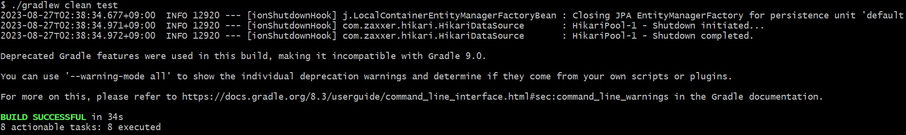
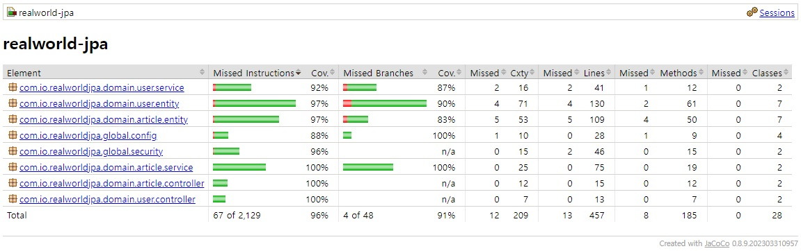
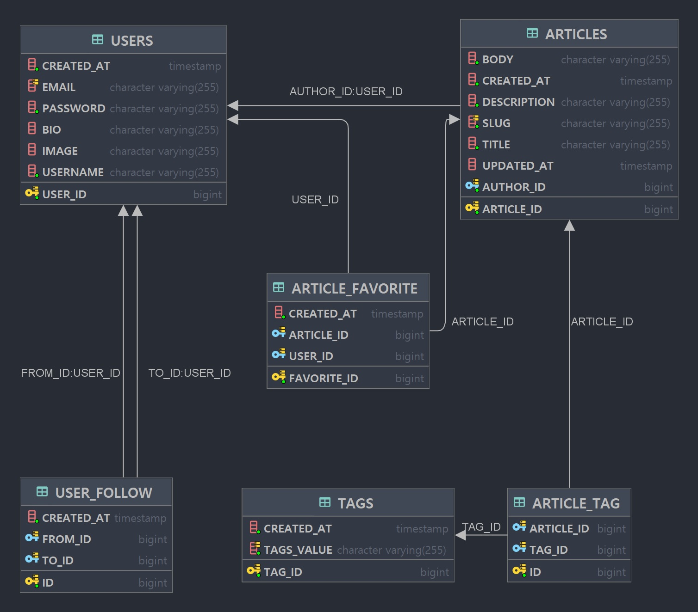
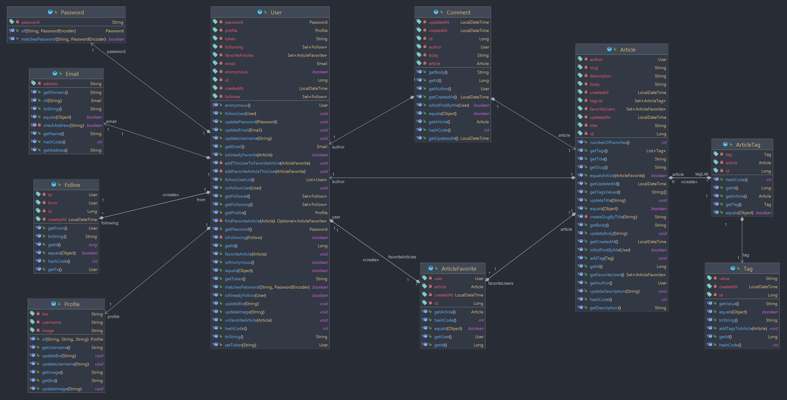
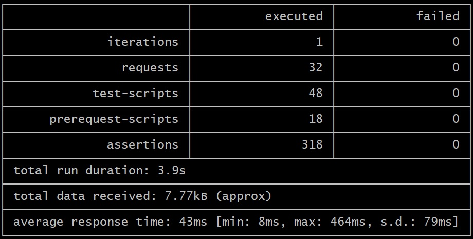

# 


[](https://github.com/Shim8934/realworld-jpa/actions/workflows/gradle.yml)
[](https://codecov.io/github/Shim8934/realworld-jpa)
[](https://opensource.org/licenses/MIT)

[ReadWorld](https://realworld-docs.netlify.app/docs/intro)  
`spring-security`, `spring-data-jpa`, `Java 17`를 사용한 Backend 프로젝트 

# Getting started  

## Run Application
``` shell
$ ./gradlew build bootRun
```

---

## How to Test
### [1) Test With Gradle](#1-gradle-test)
### [2) Test Report By Jacoco](#2-jacoco-test-report)
### [3) Test with Running Application](#3-using-postman-collectionjson)  

<br>

#### 1. Gradle Test
`gradlew` 사용한 테스트 방법  

``` shell
$ ./gradlew clean test
```
  

<br>

#### 2. Jacoco Test Report
```text
build/reports/jacoco/test/html/index.html
```
  

<br>

#### 3. Using Postman Collection.json
1) `Postman` 프로그램 사용  
`./docs/api/Conduit.postman_collection.json` 파일을 Postman Application에서 `Import` 후 Test 진행.  

<br>

2) `shell` 사용  
    ```shell
    $ ./docs/api/run-api-tests.sh
    ```

<br>

---

# Overview

## Code Convention
1) `Lombok` 사용 최소화.  
    1) 생성자 관련 `@RequiredConstructor`만 사용.
    2) ` @Data, @Getter, @Setter` 사용 금지.  
2) `Service Layer`에서 사용하는 domain Entity의 `Constructors` 는 언제나 직접 작성한 `Builder` 패턴으로 접근. (`@Builder` 사용 금지)  
3) 거의 모든 **Class, Method 테스트 진행**.
    - `equals()`, `hashCode()`, `getter()` 같은 일부 **Boilerplate** 성격의 메소드는 제외.
    - 다대다 관계를 풀어내기 위한 **Mapping Entity - ArticleTag, ArticleFavorite** 는 테스트 제외  
4) `Controller Layer`에서 **`Response로 Entity` 반환 금지**
5) `Controller`, `Service Layer` 사이의 데이터 반환은 DTO로 반환

## Diagrams

### ERD

* `Service Layer`에서 `Builder 패턴`으로 생성 제한한 Entity는 `USERS`, `ARTICLES`, `TAGS`.


### Entity Diagram With Method

* 연관 관계 메소드 중, 내부적으로 사용하는 검증 로직은 `private`으로 사용 ()  

---

# Performance

